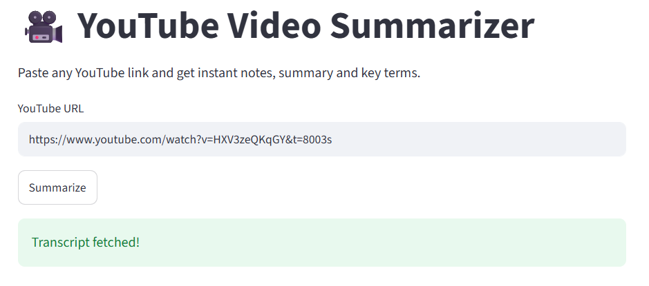
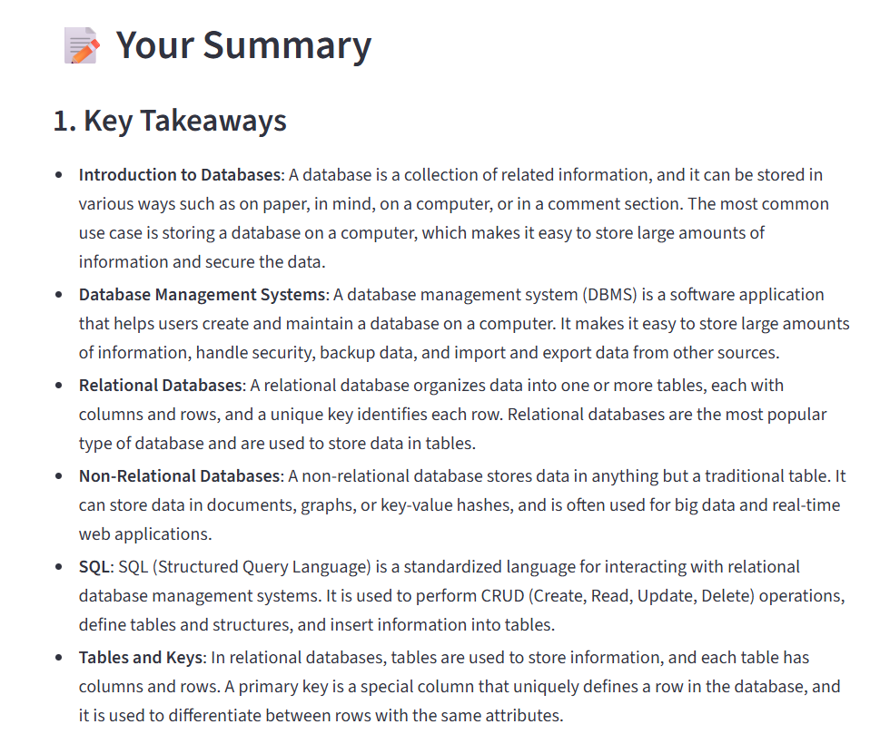
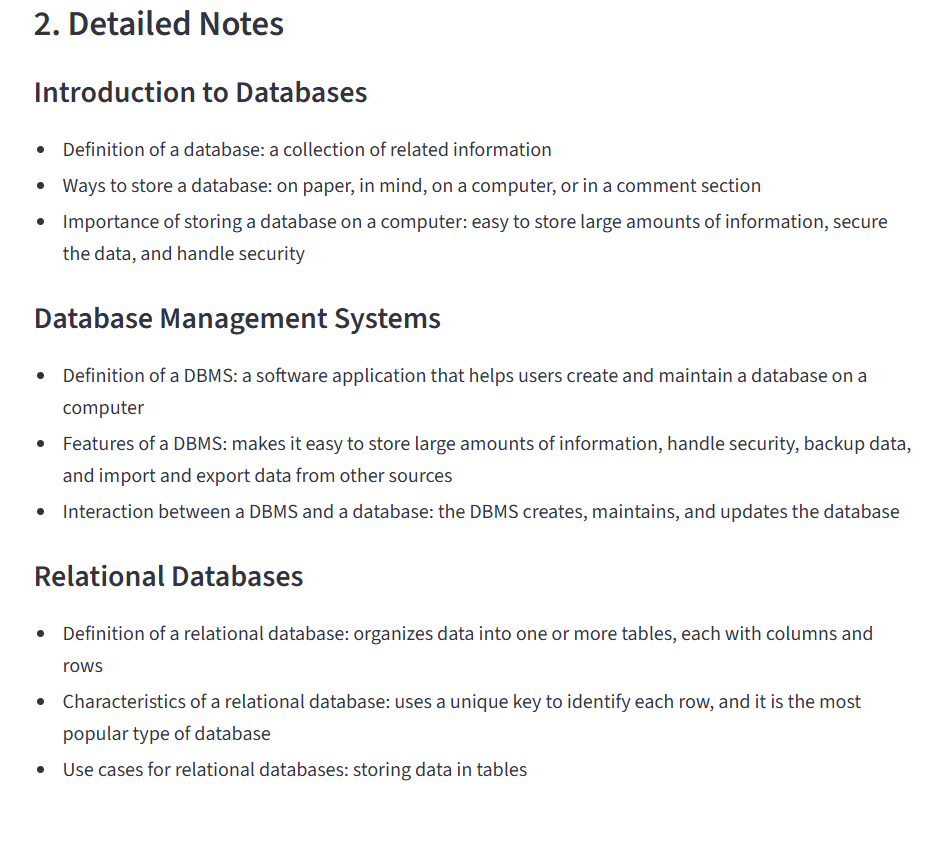

# 🎥 YouTube Video Summarizer

An AI-powered app that takes any YouTube video link and instantly generates detailed notes, summaries, and key terms using LLM.

## 🚀 Features
- Paste any YouTube URL and get instant results
- 10 detailed key takeaways
- Section-wise notes like a student would write
- 300 word blog post summary
- 8 important terms explained simply
- Action items based on the video content

## 🛠️ Tech Stack
- **Python** — core language
- **Streamlit** — UI framework
- **youtube-transcript-api** — fetches YouTube transcripts
- **Groq API (LLaMA 3.3 70B)** — AI summarization
- **python-dotenv** — environment variable management

## ⚙️ Setup Instructions

1. Clone the repository
```bash
   git clone https://github.com/yourusername/youtube-summarizer.git
   cd youtube-summarizer
```

2. Create and activate virtual environment
```bash
   python -m venv venv
   venv\Scripts\activate
```

3. Install dependencies
```bash
   pip install -r requirements.txt
```

4. Create a `.env` file and add your Groq API key

GROQ_API_KEY=your_groq_api_key_here

5. Run the app
```bash
   streamlit run app.py
```

## 📸 Demo




## 🔑 Getting API Key
- Go to [console.groq.com](https://console.groq.com)
- Sign up for free
- Create an API key — no credit card needed

## 📁 Project Structure